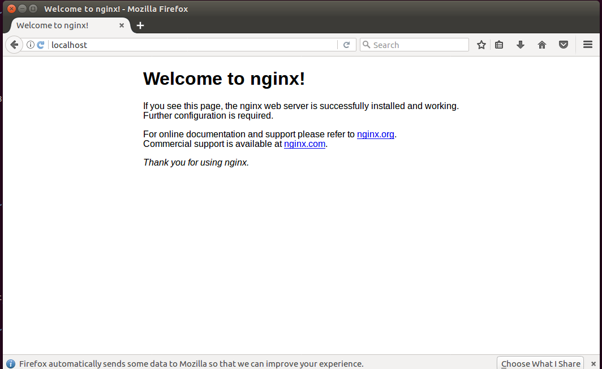

# #Nginx 安装

## #安装环境：

- 操作系统：Ubuntu 16.04
- Nginx版本：nginx-1.15.1

## #依赖包安装

1. 安装gcc g++的依赖库

```cmd
sudo apt-get install build-essential
sudo apt-get install libtool
```

2. 安装pcre依赖库（http://www.pcre.org/）

```cmd
sudo apt-get update
sudo apt-get install libpcre3 libpcre3-dev
```

3. 安装zlib依赖库（http://www.zlib.net）

```cmd
sudo apt-get install zlib1g-dev
```

4. 安装SSL依赖库（16.04默认已经安装了）

```cmd
sudo apt-get install openssl
```

## #安装Nginx

1. 下载安装版本(最新稳定版本)

```cmd
wget http://nginx.org/download/nginx-1.15.1.tar.gz
```

2. 解压安装包

```cmd
tar -zxvf nginx-1.15.1.tar.gz
#进入解压目录
cd nginx-1.15.1
```

3. 编译安装

```cmd
sudo ./configure --prefix=/usr/local/nginx
sudo make
sudo make install
```

4. 安装完成后启动

```cmd
sudo /usr/local/nginx/sbin/nginx -c /usr/local/nginx/conf/nginx.conf
```

注意：`-c` 指定配置文件的路径，不加的话，`nginx`会自动加载默认路径的配置文件，可以通过`-h`查看帮助命令。

5. 查看是否安装成

    * 查看进程
    ```cmd
    ps -ef | grep nginx
    ```

    * 通过浏览器输入地址`http://localhost:80/`，是否可以打开网页
    
